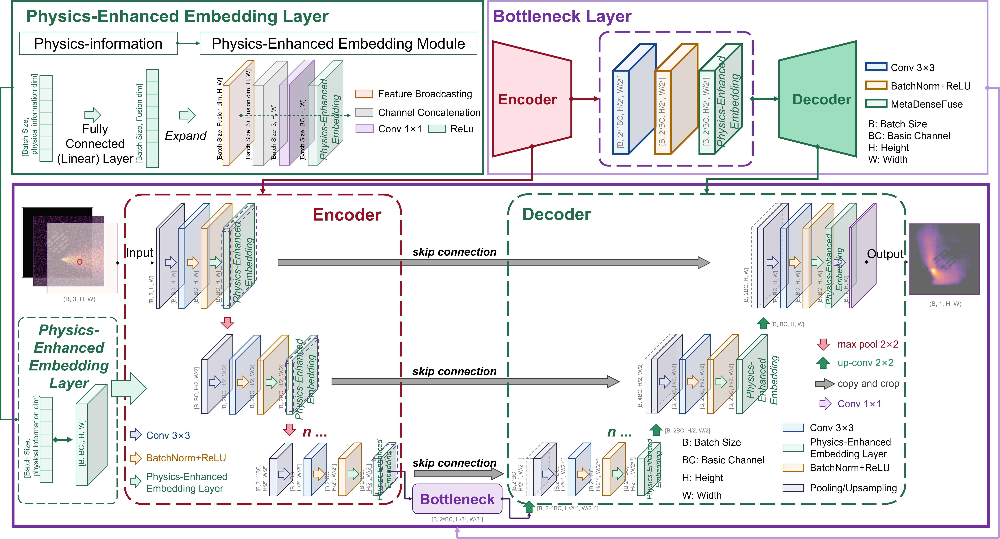
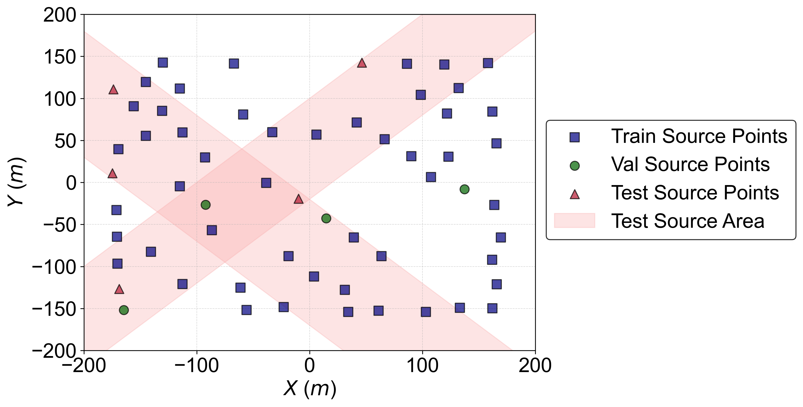

# my_project:PHENUnet

## 1.Description

**Physics-enhanced deep learning for obstacle-resolved dispersion prediction and industrial hazard assessment**

Overall architecture of the proposed PHOENIX-UNet

---
## 2.File Structure
```
PHEN-UNet/
│
├─ code_plot/                         # Scripts plotting figures (main text & supplementary)
│  ├─ 1_method.ipynb                  # Visualization of Methods
│  ├─ 2_hyperparameters_plot.ipynb    # Plots for hyperparameter sensitivity analysis
│  ├─ 3_depth5.ipynb                  # Experiments and plots for network depth analysis
│  ├─ 4_search&pred.ipynb             # Visualization of retrieval and prediction results
│  └─ support_fuc.py                  # Utility functions for figure generation and plotting
│
├─ dataset/                           # All data and configuration files
│  ├─ config_files/                   # Configuration YAMLs for training/testing
│  │  └─ config_example.yaml          # Example config file
│  │
│  ├─ data_split/                     # Predefined dataset split lists
│  │  ├─ example_train.txt            # Training data file list
│  │  ├─ example_val.txt              # Validation data file list
│  │  └─ example_test.txt             # Testing data file list
│  │
│  ├─ ori_data/                       # Original source and geometry data
│  │  ├─ building/                    # Building geometry and height data
│  │  │  ├─ building_height_map.npy   # Building height map used in physical priors
│  │  │  └─ ggeom_sd.npy              # Structural geometry representation
│  │  └─ shp_point/                   # Leak source shapefiles and metadata
│  │     ├─ m_700.shp / .shx / .dbf / .cpg  # Shapefile source locations
│  │     └─ source.csv                # CSV containing source point
│  │
│  └─ preprocessed_npz/               # Preprocessed .npz datasets ready for training
│     ├─ train/                       # Preprocessed training samples
│     ├─ val/                         # Preprocessed validation samples
│     └─ test/                        # Preprocessed testing samples
│
├─ figures/                           # Automatically generated sample visualizations
│  ├─ train.png                       # Example of preprocessed training sample
│  ├─ val.png                         # Example of preprocessed validation sample
│  └─ test.png                        # Example of preprocessed testing sample
│
├─ Networks/                          # Neural network architectures
│  └─ Networks.py                     # Implementation of PHOENIX-UNet, CNN-Embed, Only-UNet (Unet-Basic), and Only-CNN (CNN-Baisc)
│
├─ pre_data.py                        # Preprocessing dataset
│
├─ split_data.py                      # Split dataset into train/val/test
│
├─ train_phen.py                      # Training script for PHEN-UNet and baselines
│
├─ test_phen.py                       # Testing and evaluation script
│
├─ run.py                             # Entry script for running the full pipeline
│
├─ results/                           # Directory for experiment results
│  └─ exps/                           
│
└─ README.md                          # Project documentation (this file)
```

---
## 3.Software and Hardware Environment and Version

---
### 3.1 Hardware

#### 3.1.1 Computer
+ **CPU：** Intel(R) Core(TM) i7-14650HX
+ **GPU：** NVIDIA GeForce GTX 4070 SUPER
+ **RAM：** 32GB

#### 3.1.2 Workstation GPU
+ **CPU：** Intel(R) Xeon(R) Platinum 8488C 2.40 GHz
+ **GPU：** 4 x NVIDIA RTX A6000
+ **RAM：** 512GB

---
## 4.Usage

### 4.1 Environment configuration commands
- For convenience, execute the following command.

```
    pip install -r requirements.txt
```

---
### 4.2 Load dataset: Prepare the Raw Data
Download the preprocessed simulation dataset from Zenodo: [5min_m_apss_Data](https://zenodo.org/records/17008799) and save in `./dataset/5min_m_apss_Data/`
After downloading, place the data in: `pre_data.py`
```python
input_dir = "../Gas_apss/dataset/5min_m_apss_Data/"      # raw .npz directory
```
> Important: 
> Modify the input path in `pre_data.py` before running.

Change it to:
```python
input_dir = "./dataset/5min_m_apss_Data/"      # raw .npz directory
```

---
### 4.3 5min_m_apss_Data
#### 4.3.1 Overview

This dataset contains simulated **hazardous gas dispersion data** generated using the [GRAMM GRAL](https://gral.tugraz.at/features.html).
The simulations are based on the **Chemical Park model** (available in the [University of Hamburg Wind Tunnel Laboratory dataset](https://www.mi.uni-hamburg.de/en/arbeitsgruppen/windkanallabor/data-sets.html)), which provides realistic **chemical park building layouts** used as the underlying geometry for the dispersion experiments.
The dataset is designed for research in **quick prediction of hazardous gas dispersion**, atmospheric environment modeling, and data-driven methods such as deep learning.

* **File format**: `.npz` (NumPy compressed archive)
* **Leak duration**: **5 minutes**

---
#### 4.3.2 Simulation Scenarios

1. Meteorological Conditions

* **Wind direction (°)**: `0`, `90`, `180`, `270` (4 directions)
* **Wind speed (m/s)**: `0.5`, `1.5`, `2.5`, `3.5`, `4.5`, `5.5` (6 classes)
* **Atmospheric stability**: `2` (unstable), `4` (neutral), `6` (stable) (3 classes)

2. Geographic Information

* **Building distribution**: Derived from the **Hamburg University Chemical Park model**
* **Terrain features**: Terrain and building information included in the simulations

3. Hazardous Gas Source Terms

* **Substance**: Liquefied Natural Gas (LNG)
* **Source locations**: 98 potential release points available; **60 selected sources** are used for deep learning experiments


4. Data Files

The dataset is provided as `.npz` files. Each file contains the following arrays:

* **`three_channel_data`** – Preprocessed 3-channel input data
* **`con_data_98`** – Concentration fields for 98 potential hazardous gas sources
* **`con_series_data`** – Time-series concentration data over the 5-minute simulation period
* **`meteo_vec`** – Encoded meteorological condition vectors (wind speed, wind direction, stability class)
* **`meteo_series_vec`** – Time-series meteorological inputs
* **`source_vec`** – Hazardous gas source term information (location and emission parameters)
* **`file_id`** – Unique identifier for each simulation case
* **`points_4`, `points_8`, `points_16`, `points_32`, `points_64`, `points_128`, `points_256`, `points_512`** – Sampling point data at different spatial resolutions

---
### 4.4 How to Run PHOENIX-UNet?

#### 4.4.1 Preprocess the Data

Run the preprocessing script to convert original `.npy` and `.shp` files into normalized `.npz` format.

```bash
python pre_data.py
```

After execution, the processed data will be saved to:

```
./dataset/preprocessed_npz/
├─ train/
├─ val/
└─ test/
```

Each `.npz` file contains:

```
img   : (3, H, W)  # building mask, Gaussian plume, and source map
meta  : (meta_dim,) # meteorological and source condition features
label : (H, W)      # concentration field
```
---

#### 4.4.2 Split the Dataset

Split the dataset into training, validation, and testing lists.

```bash
python split_data.py
```

The following text files will be created in `./dataset/data_split/`:

```
example_train.txt
example_val.txt
example_test.txt
```

Each file contains the relative paths to corresponding `.npz` samples.

---

#### 4.4.3 Modify the Configuration

Before training, adjust the YAML configuration in:

```
./dataset/config_files/config_example.yaml
```

Typical parameters include:

```yaml
seed: 42
npz_train_dir: ./dataset/preprocessed_npz/train
npz_val_dir: ./dataset/preprocessed_npz/val
npz_test_dir: ./dataset/preprocessed_npz/test
train_txt: ./dataset/data_split/example_train.txt
val_txt: ./dataset/data_split/example_val.txt
test_txt: ./dataset/data_split/example_test.txt
model_type: phoenixunet   # options: phoenixunet, onlyunet, onlycnn, cnnembed
base_ch: 32
fuse_dim: 16
depth: 4
batch_size: 64
num_epochs: 200
lr: 1e-3
loss_type: mse
```

---
#### 4.4.4 Run

Execute the full training and testing process using:

```bash
python run.py
```

A typical console output looks like:

```
Trying on GPU 0 ...
[INFO] Using device: cuda:0
[INFO] Experiment results will be saved to ./results/exps/PHOENIXUNet_bs64_lr0.001_lossmse_ch32_dim16_depth4_phoenixunet
[INFO] Model parameter count: 4,300,113

Epoch 001 | Train Loss(mse): 0.800153 | Val Loss(mse): 0.598748 | 
Train IoU: 0.3529 | Val IoU: 0.2939 | Train MAE: 0.4200 | Val MAE: 0.3265 | 
Train R2: 0.4157 | Val R2: 0.4576 | Time: 44.13s
[INFO] Best model updated at epoch 1, saved to .../model/best_model.pt
...
Epoch 005 | Train Loss(mse): 0.279289 | Val Loss(mse): 0.295830 | 
Train IoU: 0.3770 | Val IoU: 0.4106 | Train MAE: 0.2216 | Val MAE: 0.2050 | 
Train R2: 0.7932 | Val R2: 0.7614 | Time: 42.58s
[INFO] Best model updated at epoch 5, saved to .../model/best_model.pt
```

After training completes, testing starts automatically:

```
Training completed. Starting testing ...
Loaded weights from .../model/best_model.pt
Loaded 360 test samples from ./dataset/data_split/example_test.txt
[Testing]: 100%|██████████████████████████████████████████████████| 360/360 [00:14<00:00, 25.43it/s]

[Test Summary]
Total inference time: 14.16 s
Average time per sample: 0.0393 s
Saved all predictions to .../pred_npz/test_pred_npz/

[Test Metrics] Average across all samples:
MAE   : 0.088473
MSE   : 0.065781
RMSE  : 0.231582
IoU   : 0.894143
R2    : 0.934938
```

**Outputs:**

* Best model checkpoint: `./results/exps/.../model/best_model.pt`
* Training/validation logs: `./results/exps/.../log/`
* Test predictions & metrics: `./results/exps/.../pred_npz/test_pred_npz/`
* Figures and plots: `./results/exps/.../figures/`

---
## 5.Citation

If you find this repo useful, please cite our paper.
- [1] Jianyao, Y. et al. Physics-enhanced deep learning for obstacle-resolved atmospheric dispersion in leakage accidents. Build. Environ. 114797 (2026) doi:10.1016/j.buildenv.2026.114797.
- [2] Jianyao, . yudie ., & Zhang, X. (2025). 5min_m_apss_Data (1.0.0) [Data set]. Zenodo. https://doi.org/10.5281/zenodo.17008799. [](https://doi.org/10.5281/zenodo.17008799 (2025)).

---
## 6.Contact
If you have any questions or suggestions, feel free to contact:

- Yudie Jianyao (Ph.D. student, jyyd23@mails.tsinghua.edu.cn)


